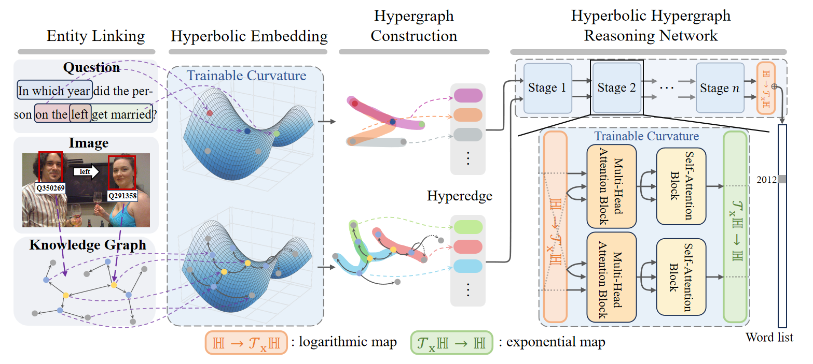

# HyperMR: Hyperbolic Hypergraph Multi-hop Reasoning for Knowledge-based Visual Question Answering
Source code for LREC-COLING 2024 paper: "HyperMR: Hyperbolic Hypergraph Multi-hop Reasoning for Knowledge-based Visual Question Answering", 

Bin Wang, Fuyong Xu, Zhenfang Zhu, Peiyu Liu
<!--* [[Paper]](https:) [[Slides]](https:)-->

>   Most of the works describe the semantic distance using the actual Euclidean distance between two nodes, which leads to distortion in modeling knowledge graphs with hierarchical and scale-free structure in KBVQA, and limits the multi-hop reasoning capability of the model. In contrast, the hyperbolic space shows exciting prospects for low-distortion embedding of graphs with hierarchical and free-scale structure. In addition, we map the different stages of reasoning into multiple adjustable hyperbolic spaces, achieving low-distortion, fine-grained reasoning.



## Requirements
This code runs on Python 3.7 and PyTorch 1.5.1. We recommend using Anaconda to install all dependencies.
```
git clone https://github.com/WANGBEAN068/HyperMR.git
conda create -n hypermr python=3.7
conda activate hypermr
conda install --yes --file requirements.txt
```

## Setup
Download preprocessed KVQA, PQ-{2H, 3H, M}, PQL-{2H, 3H, M} datasets.
```
bash data/download.sh
```

## Training

Train on KVQA dataset
* `--cfg` specifies a configuration yaml file.
* `--q_opt` specifies a question type among original (ORG) and paraphrased (PRP).
* `--n_hop` specifies a number of hop (e.g., 1-hop, 2-hop, and 3-hop).
* `--manifold` includes PoincareBall, Hyperboloid, and Euclidean.
* `--curvatures -1` means trainable curvatures.

```
# ORG, 1-hop by Poincare
python main.py --cfg ht_kvqa --n_hop 1 --q_opt org --lr 0.00001 --exp_name kvqa_org_1hop_Poincare --manifold PoincareBall --curvatures -1 --wd 1e-4
# ORG, 2-hop by Poincare
python main.py --cfg ht_kvqa --n_hop 2 --q_opt org --lr 0.00001 --exp_name kvqa_org_2hop_Poincare --manifold PoincareBall --curvatures -1 --wd 1e-4
# ORG, 3-hop by Poincare
python main.py --cfg ht_kvqa --n_hop 3 --q_opt org --lr 0.00001 --exp_name kvqa_org_3hop_Poincare --manifold PoincareBall --curvatures -1 --wd 1e-4
# PRP, 1-hop by Poincare
python main.py --cfg ht_kvqa --n_hop 1 --q_opt prp --lr 0.00001 --exp_name kvqa_prp_1hop_Poincare --manifold PoincareBall --curvatures -1 --wd 1e-4
# PRP, 2-hop by Poincare
python main.py --cfg ht_kvqa --n_hop 2 --q_opt prp --lr 0.00001 --exp_name kvqa_prp_2hop_Poincare --manifold PoincareBall --curvatures -1 --wd 1e-4
# PRP, 3-hop by Poincare
python main.py --cfg ht_kvqa --n_hop 3 --q_opt prp --lr 0.00001 --exp_name kvqa_prp_3hop_Poincare --manifold PoincareBall --curvatures -1 --wd 1e-4
```

Train on PathQuestions (PQ) dataset
```
# PQ-2H by Poincare
python main.py --data_name pq --cfg ht_pq2h --n_hop 2 --num_workers 2 --lr 0.0001 --abl_ans_fc --exp_name pq2h_PoincareBall --wd 1e-4 --manifold PoincareBall --curvatures -1 --split_seed 789
# PQ-3H by Poincare
python main.py --data_name pq --cfg ht_pq3h --n_hop 3 --num_workers 2 --lr 0.0001 --abl_ans_fc --exp_name pq3h_PoincareBall --wd 1e-4 --manifold PoincareBall --curvatures -1 --split_seed 789
# PQ-M by Poincare
python main.py --data_name pq --cfg ht_pqM --n_hop 3 --num_workers 2 --lr 0.0001 --abl_ans_fc --exp_name pqM_PoincareBall --wd 1e-4 --manifold PoincareBall --curvatures -1 --split_seed 789

```

Train on PathQuestions-Large (PQL) dataset
```
# PQL-2H by Poincare
python main.py --data_name pql --cfg ht_pql2h --n_hop 2 --num_workers 2 --lr 0.0001 --abl_ans_fc --exp_name pql2h_PoincareBall --wd 1e-4 --manifold PoincareBall --curvatures -1 --split_seed 789
# PQL-3H by Poincare
python main.py --data_name pql --cfg ht_pql3h --n_hop 3 --num_workers 2 --lr 0.0001 --abl_ans_fc --exp_name pql3h_PoincareBall --wd 1e-4 --manifold PoincareBall --curvatures -1 --split_seed 789
# PQL-M by Poincare
python main.py --data_name pql --cfg ht_pqlM --n_hop 3 --num_workers 2 --lr 0.0001 --abl_ans_fc --exp_name pqlM_PoincareBall --wd 1e-4 --manifold PoincareBall --curvatures -1 --split_seed 789
```


## Evaluation

```
# for original (ORG)
python main.py --model_name ht --cfg ht_kvqa --n_hop 1 --q_opt org --exp_name kvqa_org_1hop_Poincare --inference
python main.py --model_name ht --cfg ht_kvqa --n_hop 2 --q_opt org --exp_name kvqa_org_2hop_Poincare --inference
python main.py --model_name ht --cfg ht_kvqa --n_hop 3 --q_opt org --exp_name kvqa_org_3hop_Poincare --inference

# for phraphrased (PRP)
python main.py --model_name ht --cfg ht_kvqa --n_hop 1 --q_opt prp --exp_name kvqa_prp_1hop_Poincare --inference
python main.py --model_name ht --cfg ht_kvqa --n_hop 2 --q_opt prp --exp_name kvqa_prp_2hop_Poincare --inference
python main.py --model_name ht --cfg ht_kvqa --n_hop 3 --q_opt prp --exp_name kvqa_prp_3hop_Poincare --inference
```

We also release the trained model checkpoints that we have achieved best performance on the five repeated runs of different data splits in PQ and PQL dataset.
```
# for PQ dataset
python main.py --data_name pq --cfg ht_pq2h --n_hop 2 --num_workers 2 --abl_ans_fc --inference --exp_name pq2h_PoincareBall
python main.py --data_name pq --cfg ht_pq3h --n_hop 3 --num_workers 2 --abl_ans_fc --inference --exp_name pq3h_PoincareBall
python main.py --data_name pq --cfg ht_pqM --n_hop 3 --num_workers 2 --abl_ans_fc --inference --exp_name pqM_PoincareBall

# for PQL dataset
python main.py --data_name pql --cfg ht_pql2h --n_hop 2 --num_workers 2 --abl_ans_fc --inference --exp_name pql2h_PoincareBall --split_seed 789
python main.py --data_name pql --cfg ht_pql3h --n_hop 3 --num_workers 2 --abl_ans_fc --inference --exp_name pql3h_PoincareBall --split_seed 789
python main.py --data_name pql --cfg ht_pqlM --n_hop 3 --num_workers 2 --abl_ans_fc --inference --exp_name pqlM_PoincareBall --split_seed 789
```


## Credits
* Parts of the code were adapted from [Multimodal Transformer](https://github.com/yaohungt/Multimodal-Transformer) by Yao-Hung Hubert Tsai and [Hypergraph Transformer](https://github.com/YuJungHeo/kbvqa-public).

## Citation
```
coming soon ...
```
